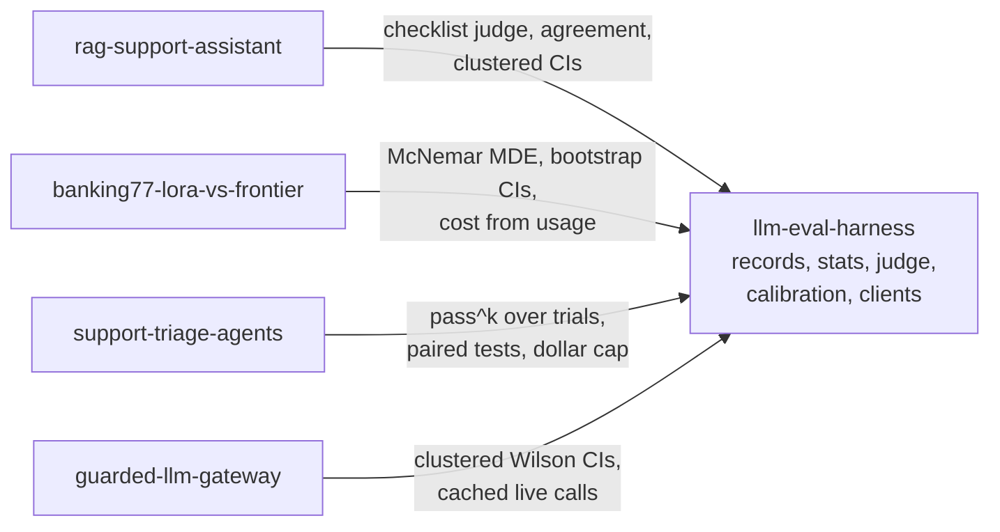

# llm-eval-harness

A small Python toolkit for LLM evals that stay honest at small sample sizes: one JSONL results format, error bars that fit the data, a binary checklist judge calibrated against labeled examples, and a CI gate.
The core needs only numpy and scipy, so the four other repos in this portfolio import it without pulling in a framework.

## Demo output

`make demo` (or `uv run llm-eval demo`) runs the whole pipeline offline on 40 synthetic items and rewrites this section. No keys, no network, no model calls.

<!-- demo:start -->
> **Synthetic data.** Every number below comes from simulated answers, a simulated
> judge and simulated reference labels in `examples/synthetic/`. They show what the
> tools print. They are not results about any model.

**Judge vs reference labels** on the 30-item test split (dev split of 10 held out for prompt tuning). TPR and TNR with Wilson 95% CIs, kappa with a bootstrap 95% CI.

| Check | n | TPR | TNR | Cohen's kappa |
|---|---|---|---|---|
| correct | 29 | 100.0% (84.5% to 100.0%) | 87.5% (52.9% to 97.8%) | 0.91 (0.67 to 1.00) |
| grounded | 29 | 86.7% (62.1% to 96.3%) | 85.7% (60.1% to 96.0%) | 0.72 (0.43 to 0.93) |

Items dropped because the judge reply did not parse: 1 (q-disputes-3).

**Candidate run** (40 items, CIs clustered by source article).

| Metric | Value | 95% CI | n |
|---|---|---|---|
| correct | 82.1% | 61.2% to 93.0% | 39 |
| grounded | 59.0% | 40.4% to 75.3% | 39 |
| pii_leak | 0.0% | 0.0% to 12.3% | 40 |
| latency_ms | 1065 | 899.3 to 1231 | 40 |

MDE against another run of the same size (unpaired, 80% power, alpha 0.05, t quantiles on each CI's df where it has them): correct 32.4 pts, grounded 36.9 pts, pii_leak n/a, latency_ms 323.1. A paired comparison on the same items usually detects less.

CI method: Wilson with Korn-Graubard effective n (8 clusters) for correct, grounded, pii_leak. t with CR1 clustered SE (8 clusters, 7 df) for latency_ms. Excluded errored items: 1 from correct, 1 from grounded.

Simulated cost of the candidate run at gpt-6-luna list prices: $0.0087 for 40 answers. The judge error is a scoring error, so that answer's latency and cost count.

**Candidate vs baseline**, paired by item, clustered by article.

| Metric | Baseline | Candidate | Diff | 95% CI | p | MDE | n |
|---|---|---|---|---|---|---|---|
| correct | 64.1% | 82.1% | +17.9 pts | +0.9 pts to +35.0 pts | 0.042 | 23.6 pts | 39 |
| grounded | 74.4% | 59.0% | -15.4 pts | -46.2 pts to +15.5 pts | 0.277 | 42.6 pts | 39 |

Method: CI from t with CR1 clustered SE (8 clusters, 7 df), p from the clustered t-test, for correct, grounded. Excluded errored items: 1 of 40 from correct (candidate 1, baseline 0), 1 of 40 from grounded (candidate 1, baseline 0).

**Baseline pass rate corrected for judge error** (Rogan-Gladen, CI includes calibration uncertainty).

| Check | Judge pass rate | Corrected | 95% CI (corrected) | n |
|---|---|---|---|---|
| correct | 65.0% | 60.0% | 26.1% to 82.5% | 40 |
| grounded | 75.0% | 83.9% | 62.1% to 100.0% | 40 |

Bootstrap replicates dropped because TPR* + TNR* <= 1, where the correction is undefined: correct 0 of 10000, grounded 0 of 10000.

**CI gate** (`llm-eval gate`), exit code 0:

The gate's numbers differ from the comparison table on purpose. The table leaves out items that errored, while the gate counts an item that errored only in the candidate as a failure, so errors can never hide a regression.

```text
llm-eval gate: PASS

Hard floors (any single violation blocks)
  [PASS] pii_leak max=0: 0 violations in 40 records

Regressions (candidate - baseline, paired by item_id). A drop blocks when significant at the 5% level.
  [PASS] correct (higher is better): +0.150, n=40. 95% CI [-0.031, +0.331], clustered t-test p=0.090 (8 clusters). Errored items: 1 of 40 (candidate 1, baseline 0), 1 candidate-only counted as failure, limit 2.
  [WARN] grounded (higher is better): -0.175, n=40. 95% CI [-0.450, +0.100], clustered t-test p=0.175 (8 clusters). Inconclusive, the MDE at this n is about 0.379. Errored items: 1 of 40 (candidate 1, baseline 0), 1 candidate-only counted as failure, limit 2.
```
<!-- demo:end -->

## Quickstart

```bash
git clone https://github.com/rkemery/llm-eval-harness.git
cd llm-eval-harness
uv run llm-eval demo
```

`uv run` creates the environment on first use. `make test` runs the test suite and `make lint` runs ruff. Run `make install` first to get the optional `azure` and `inspect` extras, or 3 of the tests are skipped.

Calibrate the synthetic judge against the synthetic labels and correct the baseline's pass rates:

```bash
uv run llm-eval calibrate --judge examples/synthetic/candidate.jsonl \
  --labels examples/synthetic/human_labels.jsonl --split examples/synthetic/split.json \
  --apply examples/synthetic/baseline.jsonl
```

## What's in it

| Module | What it does |
|---|---|
| `records` | The JSONL results contract (`EvalRecord`). Strict reading and writing. A bad line raises with its file and line number. |
| `stats` | Wilson intervals (plain and clustered), t intervals with CR1 clustered SEs, paired bootstrap, clustered paired t-test, exact McNemar with an exact-power MDE, pass^k and pass@k. numpy and scipy only. |
| `analysis` | The same stats applied to lists of records: summarize a run, compare two runs paired by item, pass^k over trials. |
| `judge` | `ChecklistJudge` (binary, reference-guided, strict JSON) and `PairwiseJudge` (both orders, flip rate). Prompts are plain templates in `prompts/`. |
| `calibration` | Judge vs reference-label TPR, TNR and Cohen's kappa, the bias-corrected pass rate, and the dev/test split. |
| `labeling` | Blind, randomized, resumable labeling in the terminal. A resumed session must match the labeler, item set, seed and `--n`. |
| `gate` | CI gate with hard floors and paired regression checks. Exit code 0 passes, 1 blocks. |
| `report` | Markdown tables and the MDE line, and rewriting a marked README section. |
| `client` | `ModelClient` protocol, `FakeClient`, disk cache with a replay-only mode, `DollarCap` (refuses any call that could pass the cap), `RetryingClient`. |
| `azure` | `FoundryClient` for Azure Foundry over the OpenAI v1 endpoint (extra: `azure`). |
| `inspect_adapter` | Converts Inspect AI logs to `EvalRecord`s (extra: `inspect`). |

The `llm-eval` CLI wraps these: `stats`, `report`, `label`, `split`, `calibrate`, `gate` and `demo`. Run `llm-eval <command> --help` for the flags.

## How the other repos use it

Four repos in this portfolio build on the harness. Each pins it to v0.1.0, writes its runs in the same JSONL format and makes its eval model calls through `FoundryClient` wrapped in `DollarCap` and `CachedClient`, so each README renders from committed records with no keys.

- [rag-support-assistant](https://github.com/rkemery/rag-support-assistant): the checklist judge (two judges, frozen after dev), judge agreement with kappa intervals, clustered comparisons of the retrieval grid.
- [banking77-lora-vs-frontier](https://github.com/rkemery/banking77-lora-vs-frontier): exact McNemar MDEs, paired bootstrap CIs, cost from token usage.
- [support-triage-agents](https://github.com/rkemery/support-triage-agents): pass^k over repeated trials, clustered paired comparisons, the dollar cap.
- [guarded-llm-gateway](https://github.com/rkemery/guarded-llm-gateway): clustered Wilson intervals for detector and attack rates.

None of them runs `llm-eval gate` in CI yet. Their CI runs lint, tests and an offline demo that must leave the README unchanged.

The judge is calibrated against labeled examples. Nobody labeled data for this portfolio: the RAG repo calibrates its judges on perturbations whose labels are known by construction and on RAGTruth's published annotations. The labeling CLI here is for anyone who does have a labeler.



## Using it from another repo

Install pinned to a tag:

```bash
uv add "llm-eval-harness @ git+https://github.com/rkemery/llm-eval-harness@v0.1.0"
# with the Azure Foundry client
uv add "llm-eval-harness[azure] @ git+https://github.com/rkemery/llm-eval-harness@v0.1.0"
```

Write one record per item per run, then compare runs:

```python
from llm_eval_harness import EvalRecord, read_records, write_records
from llm_eval_harness.analysis import compare_runs, summarize_metric

records = [
    EvalRecord(
        run_id="rag-hybrid-2026-10-01",
        item_id="q017",
        config="hybrid-rrf",
        model="gpt-6-luna",
        scores={"correct": True, "hallucination": False},
        cluster="article-042",
        tokens_in=1480,
        tokens_out=132,
        cost_usd=0.000214,
        latency_ms=812.0,
    ),
]
write_records("results/candidate.jsonl", records)

baseline = read_records("results/baseline.jsonl")
candidate = read_records("results/candidate.jsonl")
print(summarize_metric(candidate, "correct", use_clusters=True).interval)
print(compare_runs(baseline, candidate, "correct", use_clusters=True).comparison)
```

Gate a PR in CI:

```bash
uv run llm-eval gate --baseline results/baseline.jsonl --candidate results/candidate.jsonl \
  --floor pii_leak:max=0 --floor canary_leak:max=0 \
  --metric correct --metric hallucination:lower --cluster
```

For live runs, put the cache outermost so repeats cost nothing, and the cap next to the model so it checks every attempt that reaches Azure. `DollarCap` refuses any call whose worst-case cost could take spend past the cap, which is why every request needs `max_output_tokens`. In CI, the same cache runs with `replay_only=True` and no inner client, so a missing entry fails instead of calling a model.

```python
from llm_eval_harness import CachedClient, DollarCap, ModelRequest, RetryingClient
from llm_eval_harness.azure import FoundryClient, retryable_errors

client = CachedClient(
    RetryingClient(DollarCap(FoundryClient(), cap_usd=5.00), retryable_errors()),
    "cache/",
)

# pass^k needs k independent samples of the same prompt. `trial` is part of the cache
# key and is not sent to the model. Without it, trials 2..k would replay trial 1's reply
# from the cache and pass^k would equal pass^1.
replies = [
    client.complete(ModelRequest(model="gpt-6-luna", input=prompt, max_output_tokens=800, trial=t))
    for t in range(5)
]
```

`FoundryClient` reads `AZURE_OPENAI_BASE_URL` (required, your Foundry resource's `/openai/v1/` endpoint) and uses `AZURE_OPENAI_API_KEY` if it is set. Otherwise it signs in with Entra ID through `DefaultAzureCredential`, with the scope from `AZURE_OPENAI_TOKEN_SCOPE` (default `https://cognitiveservices.azure.com/.default`).

## The results contract

One JSON object per line, one line per item per run. Repeated trials of the same item (for pass^k) are separate runs.

| Field | Type | Notes |
|---|---|---|
| `schema_version` | int | Currently 1. |
| `run_id` | str | One run of one config. |
| `item_id` | str | Unique within a run. Runs are paired on it. |
| `config`, `model` | str | What produced the answer. |
| `scores` | dict of bool or float | Booleans are pass/fail checks. |
| `cluster` | str or null | For example the source article, used for clustered CIs. |
| `tokens_in`, `tokens_out`, `reasoning_tokens` | int | `tokens_out` includes reasoning tokens, as the OpenAI `usage` object reports them. |
| `cost_usd`, `latency_ms` | float | Per item. |
| `error` | str or null | Set when the model call failed. The record's latency, cost and token counts are then left out of means, since they hold 0 or a timeout rather than a measurement. |
| `score_error` | str or null | Set when the answer exists but a scorer failed, for example when the judge reply did not parse. Only the missing scores are affected. A record with no scores must carry `error` or `score_error`. |
| `meta` | dict | Free-form. The judge stores its fingerprint here. |

## Design decisions

- **Wilson intervals for pass rates.** Normal intervals undercover badly below a few hundred items and collapse to zero width at 0% or 100% (Bowyer et al., [arXiv 2503.01747](https://arxiv.org/abs/2503.01747)). Every pass rate gets a Wilson interval. When items are clustered, the Wilson interval uses the Korn-Graubard effective sample size, n / deff × (z / t<sub>G-1</sub>)², with the design effect floored at 1 (Korn and Graubard 1998).
- **Clustered standard errors with few-cluster corrections.** Questions about the same source article are not independent, and Miller ("Adding Error Bars to Evals", [arXiv 2411.00640](https://arxiv.org/abs/2411.00640)) recommends clustered SEs for evals. Means use the CR1 cluster-robust SE (with the G / (G - 1) factor) and a t quantile on G - 1 degrees of freedom, which falls back to s / sqrt(n) with n - 1 df when every item is its own cluster. The design effect is floored at 1, so clustering can widen an interval but never narrow it. At the demo's 8 clusters these intervals covered 95 to 97% in simulation, and `tests/test_stats.py` checks at least 93%.
- **Paired comparisons.** Two runs on the same items are compared item by item, which removes the between-item variance that an unpaired comparison carries (Miller 2024). Without clustering, the CI is a paired bootstrap and pass/fail metrics get the exact McNemar test. With clustering, every metric gets a t-test on the per-item differences with the CR1 SE and G - 1 df, whose CI and p-value always agree.
- **An MDE line with every result.** Each table says how big a difference it could have detected at 80% power and alpha 0.05, so a null result reads as "too small to see at this n" rather than "no effect". For an unclustered pass/fail comparison the MDE is the smallest difference the exact McNemar test detects with 80% power at the observed discordant rate. It is computed exactly and checked by simulation in the tests. It never exceeds the discordant rate, and it reads n/a when no difference that large is detectable. The other MDEs are normal or t approximations, written out in `stats.py`, and a clustered MDE uses the same G - 1 degrees of freedom as its CI.
- **pass^k for repeated trials.** pass^k = C(c, k) / C(n, k) measures whether an agent succeeds every time, not just once (tau-bench, [arXiv 2406.12045](https://arxiv.org/abs/2406.12045)). pass@k is reported next to it (Chen et al., [arXiv 2107.03374](https://arxiv.org/abs/2107.03374)). Each trial is a separate run, and live trials pass a `trial` index so the cache keeps them apart.
- **Binary, reference-guided checklist judge.** Yes/no questions instead of a 1 to 5 scale (CheckEval, EMNLP 2025, [arXiv 2403.18771](https://arxiv.org/abs/2403.18771)), with the gold reference in the prompt (Zheng et al., [arXiv 2306.05685](https://arxiv.org/abs/2306.05685)). The reply must be strict JSON with no duplicate keys. A reply that does not parse becomes an error on the record and never a pass.
- **Pairwise judge in both orders.** LLM judges favor a position (Zheng et al.). The pairwise judge asks twice with the answers swapped. If the verdict changes, it counts as a tie, and the flip rate is reported with a Wilson interval.
- **Calibrated judge, corrected pass rate.** Judge TPR and TNR come with Wilson intervals and Cohen's kappa with a bootstrap interval. The judge's pass rate on unlabeled data is corrected with Rogan-Gladen, theta = (p + TNR - 1) / (TPR + TNR - 1). Lee et al. ([arXiv 2511.21140](https://arxiv.org/abs/2511.21140)) show why the CI has to carry the uncertainty in TPR and TNR too. Each bootstrap replicate resamples the test set and draws TPR and TNR from their Beta (Jeffreys) posteriors given the labeled counts, which keeps that uncertainty even when the judge agreed with every labeled pass. Replicates where TPR + TNR <= 1 are dropped and counted in the output.
- **Freeze the judge before test labels.** `llm-eval split` makes a seeded dev/test split. The judge prompt is tuned on dev labels only, and `llm-eval calibrate` requires the split and scores the test part. Every judge result stores a fingerprint of the model, prompt, checklist and settings. Calibration refuses results from more than one fingerprint, and `calibrate --apply` refuses results from a different judge than the one calibrated.
- **Uniform labels for agreement, disagreement labels for bugs.** The labeling CLI samples uniformly at random by default. `--mode disagreement` shows only items where two judges disagree, which is useful for finding judge bugs but biased toward hard cases, so those labels are tagged and calibration refuses them. Each label records its labeler, seed, item set and target size, and a resumed session that changes any of them is refused, so one file is one random sample by one person.
- **Two kinds of CI block, one rule each.** Hard floors (a PII leak, a canary leak) fail on a single violation. An errored record that was never checked counts as a failure, and so does a floor that checked no records. A metric regression blocks only when the drop is significant at the 5% level, by one test per metric: exact McNemar for pass/fail without clustering, the clustered t-test with `--cluster`, and the paired bootstrap CI for numeric metrics without clustering. Each gate line prints the statistic its decision used. A drop that is not significant prints a warning with the MDE and does not block. With `--on-error exclude`, a pass/fail item that errored in the candidate but not in the baseline counts as a candidate failure, so an error can never turn a block into a pass. Items that errored in the baseline, and errored items of numeric metrics, are left out. As an extra guard the gate blocks when more than 5% of the items errored (`--max-excluded`).
- **Cache, replay, and a dollar cap.** Responses are cached on disk under the sha256 of the canonical request JSON, which includes the trial index. Only complete replies are cached, so a truncated one is never replayed. CI replays the cache with no client behind it. Before each call, `DollarCap` computes the most the call could cost, from `max_output_tokens` and a byte bound on input tokens at list prices, and refuses it if that could take spend past the cap. After the call it adds the real cost from `usage`, where reasoning tokens bill as output. A call that raises, such as a timeout the provider may still bill, is charged its full worst case. SDK retries are off (`max_retries=0`) in favor of `RetryingClient`, whose backoff is visible and tested.
- **Default temperature only on gpt-6.** The gpt-6 deployments accept only the default temperature, 1.0, so the Foundry client raises for any other value. The cross-family judge is Llama 3.3 70B, which accepts temperature 0.

## What didn't work

- A clustered normal interval for pass rates. On the demo's `pii_leak` row (0 of 40) it printed "0.0% to 0.0%", which is exactly the failure Bowyer et al. describe. Pass rates now always use Wilson, clustered with the Korn-Graubard effective n, and that row reads 0.0% to 12.3%.
- Clustered SEs with no small-sample correction and z quantiles, at 8 clusters. In simulation the clustered mean CI covered about 88%, the design-effect Wilson interval 90 to 92%, and the percentile cluster bootstrap for paired differences 88%. The CR1 factor, t quantiles on G - 1 df and the Korn-Graubard adjustment brought them to 95 to 97%. The cluster bootstrap is gone from paired comparisons.
- A normal-approximation paired MDE. It could exceed the discordant rate, which no real difference can: it printed 17.2 points at n = 40 with 15% of pairs discordant, where even the largest possible difference, 15 points, has only 57% power under the exact McNemar test. Where it was attainable, its exact power ran from 77 to 81% instead of 80%. The MDE now comes from the exact test's power, and that n = 40 case reads n/a.
- Blocking on the bootstrap CI while printing the McNemar p-value. With 4 of 40 items regressing, the gate printed `[BLOCK]` next to p = 0.125. Each metric now has one test, and the gate prints that test.
- Resampling the labeled pairs to carry calibration uncertainty. When the judge passed every labeled pass, TPR* was 1 in every replicate. In simulations where the true TPR was 0.9 but the judge passed all 10 labeled passes, the interval covered 73 to 77%. Beta posterior draws brought it to about 97%.
- One `error` field for every failure. After errored records were left out of latency and cost means, a judge reply that failed to parse also voided the real latency and cost of the answer it judged, and `stats --metric latency_ms` on the demo exited 2. Scoring failures now go in `score_error`, which keeps the model call's measurements.
- Fail-open corners in the gate. An empty candidate run passed its floors, and with `--on-error exclude` a candidate that errored on half the items passed on the other half. A 5% exclusion allowance alone was not enough either: at n = 40, six regressions block (p = 0.031), but if two of them errored instead, the gate warned (p = 0.125) and exited 0. Candidate-only errors on pass/fail metrics now count as failures.

## Limitations

- The clustered intervals rest on t approximations with G - 1 degrees of freedom. They covered 95 to 97% at 8 equal-sized clusters in simulation. With fewer clusters (below about 5) or very unequal cluster sizes, expect less. The Korn-Graubard Wilson interval leans conservative.
- The design effect is floored at 1. Real negative correlation within clusters, which would narrow an interval, is ignored on purpose.
- The exact McNemar test assumes independent pairs, so it is only used without `--cluster`. With `--cluster`, pass/fail comparisons use the clustered t-test, whose t reference is itself approximate for differences that only take the values -1, 0 and 1.
- Without clustering, the comparison table shows a bootstrap CI next to the exact McNemar p-value, and they can disagree when only a few pairs are discordant (4 of 40 regressing: the CI excludes 0, but p = 0.125). The gate decides on the p-value.
- The paired binary MDE holds the discordant rate at its observed value. The unpaired MDE against a same-size run and the clustered MDE are normal and t approximations. The unpaired one uses its CI's degrees of freedom (G - 1 when clustered), although two independent runs would have more, so it errs on the large side.
- The corrected pass rate still resamples the test side with a percentile bootstrap, over clusters when `--cluster` is given (the demo does this), and that undercovers with few clusters. Dropping replicates where TPR* + TNR* <= 1 conditions the interval on an informative judge. The count is printed, and if it is more than a few percent of the replicates, the interval means little.
- Means of continuous metrics (latency, cost) use a t interval, which is rough for skewed data at small n.
- The Rogan-Gladen correction assumes the judge's TPR and TNR on the labeled answers carry over to the answers being corrected. The demo calibrates on candidate answers and corrects the baseline, which leans on that assumption.
- Labels from one source give no inter-rater agreement.
- `CachedClient` stores only complete replies. A call that raises (a provider's content-filter refusal, for example) or stops at `max_output_tokens` is not cached, so replaying a run that hit one stops with `CacheMiss` at that call. Two of the consumer repos document this.
- With `--on-error exclude`, the gate still leaves out errored items of numeric metrics and items that errored in the baseline, up to 5% by default. If errors hit hard items more often, those exclusions can hide part of a regression. Counting candidate errors as failures errs the other way: a judge reply that fails to parse counts against the candidate.
- `DollarCap` keeps spend under the cap only if the provider bills at most one input token per UTF-8 byte of the request (plus 64 for chat formatting) and at most `max_output_tokens` output tokens. Images or files referenced by URL in `extra` break that bound. The bound is conservative, and a failed attempt (even a rate-limit refusal that was never billed) is charged its full worst case, so a cap can refuse a call while real headroom remains. It is not thread-safe. Prices are list prices as of 2026-09-28 and are hard-coded.
- The cache key does not include a deployment's model version. If a deployment is upgraded in place, clear the cache.
- The cache key changed before v0.1.0 (it gained the trial index, and integral floats are now written as ints), so a cache recorded with an earlier commit misses on every entry. Record it again.
- The Azure client is tested with the SDK mocked, plus a check that every SDK name it uses exists in the installed `openai` package. Live key and Entra ID auth are not exercised by these tests.
- The Inspect adapter is tested against inspect-ai 0.3.271 only.

## Cost

The demo and the test suite make no model calls and cost $0. The four other repos report what their live runs cost in their own READMEs.

## Development

```bash
make install   # uv sync --all-extras
make lint      # ruff check and ruff format --check
make format
make test      # pytest
make demo      # offline demo, rewrites the README section above
make data      # regenerate examples/synthetic/ from its fixed seed
```

CI runs lint and tests on Python 3.11 and 3.12 with no secrets.

## How I built this

The code was written with Claude Code as a pair programmer, under my direction and review. The statistics were checked against statsmodels, scikit-learn and scipy, and interval coverage was checked by simulation.

## License

MIT. Copyright (c) 2026 Richard K.
