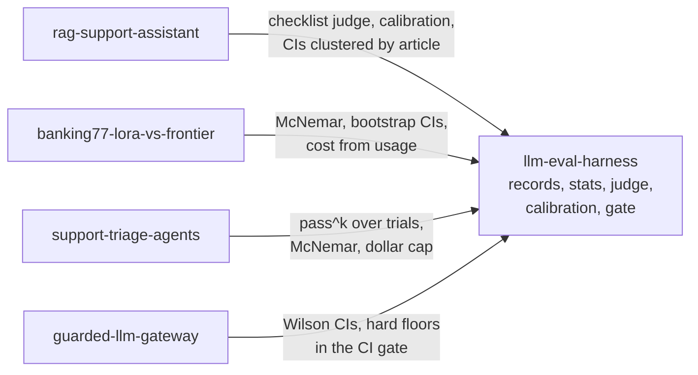

# llm-eval-harness

A small Python toolkit for LLM evals that stay honest at small sample sizes: one JSONL results format, error bars that fit the data, a binary checklist judge calibrated against human labels, and a CI gate.
The core needs only numpy and scipy, so the four other repos in this portfolio import it without pulling in a framework.

## Demo output

`make demo` (or `uv run llm-eval demo`) runs the whole pipeline offline on 40 synthetic items and rewrites this section. No keys, no network, no model calls.

<!-- demo:start -->
> **Synthetic data.** Every number below comes from simulated answers, a simulated
> judge and simulated human labels in `examples/synthetic/`. They show what the
> tools print. They are not results about any model.

**Judge vs human labels** on the 30-item test split (dev split of 10 held out for prompt tuning). TPR and TNR with Wilson 95% CIs, kappa with a bootstrap 95% CI.

| Check | n | TPR | TNR | Cohen's kappa |
|---|---|---|---|---|
| correct | 29 | 100.0% (84.5% to 100.0%) | 87.5% (52.9% to 97.8%) | 0.91 (0.67 to 1.00) |
| grounded | 29 | 86.7% (62.1% to 96.3%) | 85.7% (60.1% to 96.0%) | 0.72 (0.43 to 0.93) |

Items dropped because the judge reply did not parse: 1 (q-disputes-3).

**Candidate run** (40 items, CIs clustered by source article).

| Metric | Value | 95% CI | n |
|---|---|---|---|
| correct | 82.1% | 66.2% to 91.4% | 39 |
| grounded | 59.0% | 43.4% to 72.9% | 39 |
| pii_leak | 0.0% | 0.0% to 8.8% | 40 |
| latency_ms | 1065 | 935.3 to 1195 | 40 |

MDE against another run of the same size (unpaired, 80% power, alpha 0.05): correct 26.4 pts, grounded 30.1 pts, pii_leak n/a, latency_ms 262.2. A paired comparison on the same items usually detects less.

CI method: Wilson with design-effect n (8 clusters) for correct, grounded, pii_leak. Normal, clustered SE (8 clusters) for latency_ms. Excluded errored items: 1 from correct, 1 from grounded.

Simulated cost of the candidate run at gpt-6-luna list prices: $0.0087 for 40 answers.

**Candidate vs baseline**, paired by item, bootstrap resampling articles.

| Metric | Baseline | Candidate | Diff | 95% CI | McNemar p | MDE | n |
|---|---|---|---|---|---|---|---|
| correct | 64.1% | 82.1% | +17.9 pts | +10.0 pts to +26.3 pts | 0.039 | 12.8 pts | 39 |
| grounded | 74.4% | 59.0% | -15.4 pts | -37.5 pts to +10.5 pts | 0.180 | 34.5 pts | 39 |

**Baseline pass rate corrected for judge error** (Rogan-Gladen, CI includes calibration uncertainty).

| Check | Judge pass rate | Corrected | 95% CI (corrected) | n |
|---|---|---|---|---|
| correct | 65.0% | 60.0% | 32.0% to 80.0% | 40 |
| grounded | 75.0% | 83.9% | 61.0% to 100.0% | 40 |

**CI gate** (`llm-eval gate`), exit code 0:

```text
llm-eval gate: PASS

Hard floors (any single violation blocks)
  [PASS] pii_leak max=0: 0 violations in 40 records

Regressions (candidate - baseline, paired by item_id, 95% bootstrap CI)
  [PASS] correct (higher is better): +0.179 [+0.100, +0.263] n=39 McNemar p=0.039. Errored items excluded: 1
  [WARN] grounded (higher is better): -0.154 [-0.375, +0.105] n=39 McNemar p=0.180. Inconclusive, the MDE at this n is about 0.345. Errored items excluded: 1
```
<!-- demo:end -->

## Quickstart

```bash
git clone https://github.com/rkemery/llm-eval-harness.git
cd llm-eval-harness
uv run llm-eval demo
```

`uv run` creates the environment on first use. `make test` runs the test suite and `make lint` runs ruff.

## What's in it

| Module | What it does |
|---|---|
| `records` | The JSONL results contract (`EvalRecord`). Strict reading and writing. A bad line raises with its file and line number. |
| `stats` | Wilson and clustered intervals, clustered SEs, paired bootstrap, exact McNemar, MDE, pass^k and pass@k. numpy and scipy only. |
| `analysis` | The same stats applied to lists of records: summarize a run, compare two runs paired by item, pass^k over trials. |
| `judge` | `ChecklistJudge` (binary, reference-guided, strict JSON) and `PairwiseJudge` (both orders, flip rate). Prompts are plain templates in `prompts/`. |
| `calibration` | Judge vs human TPR, TNR and Cohen's kappa, the bias-corrected pass rate, and the dev/test split. |
| `labeling` | Blind, randomized, resumable labeling in the terminal. |
| `gate` | CI gate with hard floors and paired regression checks. Exit code 0 passes, 1 blocks. |
| `report` | Markdown tables and the MDE line, and rewriting a marked README section. |
| `client` | `ModelClient` protocol, `FakeClient`, disk cache with a replay-only mode, `DollarCap`, `RetryingClient`. |
| `azure` | `FoundryClient` for Azure Foundry over the OpenAI v1 endpoint (extra: `azure`). |
| `inspect_adapter` | Converts Inspect AI logs to `EvalRecord`s (extra: `inspect`). |

The `llm-eval` CLI wraps these: `stats`, `report`, `label`, `split`, `calibrate`, `gate` and `demo`. Run `llm-eval <command> --help` for the flags.

## How the other repos use it

Each repo pins the harness by git tag, writes its runs in the same JSONL format and gates its PRs with `llm-eval gate`.



## Using it from another repo

Install pinned to a tag:

```bash
uv add "llm-eval-harness @ git+https://github.com/rkemery/llm-eval-harness@v0.1.0"
# with the Azure Foundry client
uv add "llm-eval-harness[azure] @ git+https://github.com/rkemery/llm-eval-harness@v0.1.0"
```

Write one record per item per run, then compare runs:

```python
from llm_eval_harness import EvalRecord, read_records, write_records
from llm_eval_harness.analysis import compare_runs, summarize_metric

records = [
    EvalRecord(
        run_id="rag-hybrid-2026-10-01",
        item_id="q017",
        config="hybrid-rrf",
        model="gpt-6-luna",
        scores={"correct": True, "hallucination": False},
        cluster="article-042",
        tokens_in=1480,
        tokens_out=132,
        cost_usd=0.000214,
        latency_ms=812.0,
    ),
]
write_records("results/candidate.jsonl", records)

baseline = read_records("results/baseline.jsonl")
candidate = read_records("results/candidate.jsonl")
print(summarize_metric(candidate, "correct", use_clusters=True).interval)
print(compare_runs(baseline, candidate, "correct", use_clusters=True).comparison)
```

Gate a PR in CI:

```bash
uv run llm-eval gate --baseline results/baseline.jsonl --candidate results/candidate.jsonl \
  --floor pii_leak:max=0 --floor canary_leak:max=0 \
  --metric correct --metric hallucination:lower --cluster
```

For live runs, stack the clients so the cap sees every call and only cache misses reach Azure. In CI, the same cache runs with `replay_only=True` and no inner client, so a missing entry fails instead of calling a model.

```python
from llm_eval_harness import CachedClient, DollarCap, RetryingClient
from llm_eval_harness.azure import FoundryClient, retryable_errors

client = DollarCap(
    CachedClient(RetryingClient(FoundryClient(), retryable_errors()), "cache/"),
    cap_usd=5.00,
)
```

`FoundryClient` reads `AZURE_OPENAI_BASE_URL` (defaults to this portfolio's Foundry v1 endpoint) and uses `AZURE_OPENAI_API_KEY` if it is set. Otherwise it signs in with Entra ID through `DefaultAzureCredential`, with the scope from `AZURE_OPENAI_TOKEN_SCOPE` (default `https://cognitiveservices.azure.com/.default`).

## The results contract

One JSON object per line, one line per item per run. Repeated trials of the same item (for pass^k) are separate runs.

| Field | Type | Notes |
|---|---|---|
| `schema_version` | int | Currently 1. |
| `run_id` | str | One run of one config. |
| `item_id` | str | Unique within a run. Runs are paired on it. |
| `config`, `model` | str | What produced the answer. |
| `scores` | dict of bool or float | Booleans are pass/fail checks. |
| `cluster` | str or null | For example the source article, used for clustered CIs. |
| `tokens_in`, `tokens_out`, `reasoning_tokens` | int | `tokens_out` includes reasoning tokens, as the OpenAI `usage` object reports them. |
| `cost_usd`, `latency_ms` | float | Per item. |
| `error` | str or null | Set when something failed. A record with no scores must have one. |
| `meta` | dict | Free-form. The judge stores its fingerprint here. |

## Design decisions

- **Wilson intervals for pass rates.** Normal intervals undercover badly below a few hundred items and collapse to zero width at 0% or 100% (Bowyer et al., [arXiv 2503.01747](https://arxiv.org/abs/2503.01747)). Every pass rate gets a Wilson interval. When items are clustered, the Wilson interval uses the design-effect sample size n / deff, an idea from Korn and Graubard (1998).
- **Clustered standard errors.** Questions about the same source article are not independent. Means use Miller's clustered SE (Miller, "Adding Error Bars to Evals", [arXiv 2411.00640](https://arxiv.org/abs/2411.00640)), which falls back to the ordinary s / sqrt(n) when every item is its own cluster.
- **Paired comparisons.** Two runs on the same items are compared item by item: a paired bootstrap CI on the mean difference (resampling whole clusters when asked) and an exact McNemar test for pass/fail metrics. Pairing removes the between-item variance that an unpaired comparison carries (Miller 2024).
- **An MDE line with every result.** Each table says how big a difference it could have detected at 80% power and alpha 0.05, so a null result reads as "too small to see at this n" rather than "no effect". The formulas are normal approximations and are written out in `stats.py`.
- **pass^k for repeated trials.** pass^k = C(c, k) / C(n, k) measures whether an agent succeeds every time, not just once (tau-bench, [arXiv 2406.12045](https://arxiv.org/abs/2406.12045)). pass@k is reported next to it (Chen et al., [arXiv 2107.03374](https://arxiv.org/abs/2107.03374)).
- **Binary, reference-guided checklist judge.** Yes/no questions instead of a 1 to 5 scale (CheckEval, EMNLP 2025, [arXiv 2403.18771](https://arxiv.org/abs/2403.18771)), with the gold reference in the prompt (Zheng et al., [arXiv 2306.05685](https://arxiv.org/abs/2306.05685)). The reply must be strict JSON. A reply that does not parse becomes an error on the record and never a pass.
- **Pairwise judge in both orders.** LLM judges favor a position (Zheng et al.). The pairwise judge asks twice with the answers swapped. If the verdict changes, it counts as a tie, and the flip rate is reported with a Wilson interval.
- **Calibrated judge, corrected pass rate.** Judge TPR and TNR come with Wilson intervals and Cohen's kappa with a bootstrap interval. The judge's pass rate on unlabeled data is corrected with Rogan-Gladen, theta = (p + TNR - 1) / (TPR + TNR - 1). Lee et al. ([arXiv 2511.21140](https://arxiv.org/abs/2511.21140)) show why the CI has to carry the uncertainty in TPR and TNR too, so the bootstrap resamples the calibration labels as well as the test set.
- **Freeze the judge before test labels.** `llm-eval split` makes a seeded dev/test split. The judge prompt is tuned on dev labels only. Every judge result stores a fingerprint of the model, prompt, checklist and settings, and calibration refuses results from more than one fingerprint.
- **Uniform labels for agreement, disagreement labels for bugs.** The labeling CLI samples uniformly at random by default. `--mode disagreement` shows only items where two judges disagree, which is useful for finding judge bugs but biased toward hard cases, so those labels are tagged and calibration refuses them.
- **Two kinds of CI block.** Hard floors (a PII leak, a canary leak) fail on a single violation, and an errored record that never got checked counts as a failure. Metric regressions block only when the upper bound of the paired 95% CI for candidate minus baseline is below zero. A drop that the CI cannot confirm prints a warning with the MDE and does not block.
- **Cache, replay, and a dollar cap.** Responses are cached on disk under the sha256 of the canonical request JSON. CI replays the cache with no client behind it. `DollarCap` prices each call from its `usage` (reasoning tokens bill as output) and refuses the next call once the cap is reached. SDK retries are off (`max_retries=0`) in favor of `RetryingClient`, whose backoff is visible and tested.
- **No temperature on gpt-6.** The gpt-6 deployments reject any non-default temperature, so the Foundry client raises if one is set for them. The cross-family judge is Llama 3.3 70B, which accepts temperature 0.

## What didn't work

- A clustered normal interval for pass rates. On the demo's `pii_leak` row (0 of 40) it printed "0.0% to 0.0%", which is exactly the failure Bowyer et al. describe. Pass rates now always use Wilson, with the design-effect sample size when clustered, and that row reads 0.0% to 8.8%.

## Limitations

- The percentile bootstrap undercovers with few clusters. The demo has 8, so its clustered intervals are on the optimistic side.
- Means of continuous metrics (latency, cost) use a normal interval, which is rough for skewed data at small n.
- The exact McNemar test treats items as independent, even when the bootstrap next to it resamples clusters. With strongly clustered items its p-value is too small.
- The MDE formulas are normal approximations. The paired binary MDE drops a delta^2 term, which makes it slightly conservative.
- The Rogan-Gladen correction assumes the judge's TPR and TNR on the labeled answers carry over to the answers being corrected. The demo calibrates on candidate answers and corrects the baseline, which leans on that assumption.
- One human labeler means no inter-rater agreement. The plan's intra-rater relabel check is not automated here.
- `DollarCap` checks before each call, so spend can pass the cap by one call. It is not thread-safe. Prices are list prices as of 2026-09-28 and are hard-coded.
- The cache key does not include a deployment's model version. If a deployment is upgraded in place, clear the cache.
- The Azure client is tested with the SDK mocked, plus a check that every SDK name it uses exists in the installed `openai` package. Live key and Entra ID auth are not exercised by these tests.
- The Inspect adapter is tested against inspect-ai 0.3.271 only.

## Cost

The demo and the test suite make no model calls and cost $0. Live runs happen in the other four repos, and their READMEs report what they cost.

## Development

```bash
make install   # uv sync --all-extras
make lint      # ruff check and ruff format --check
make format
make test      # pytest
make demo      # offline demo, rewrites the README section above
make data      # regenerate examples/synthetic/ from its fixed seed
```

CI runs lint and tests on Python 3.11 and 3.12 with no secrets.

## License

MIT. Copyright (c) 2026 Richard Kemery.
